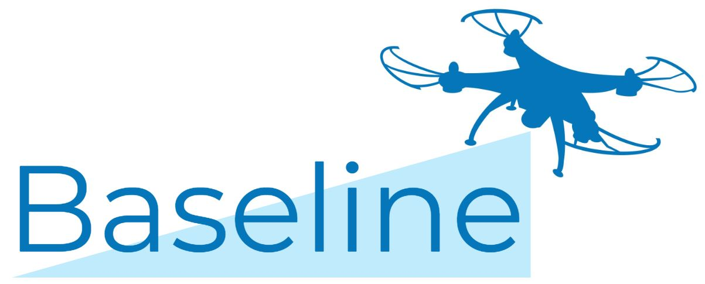
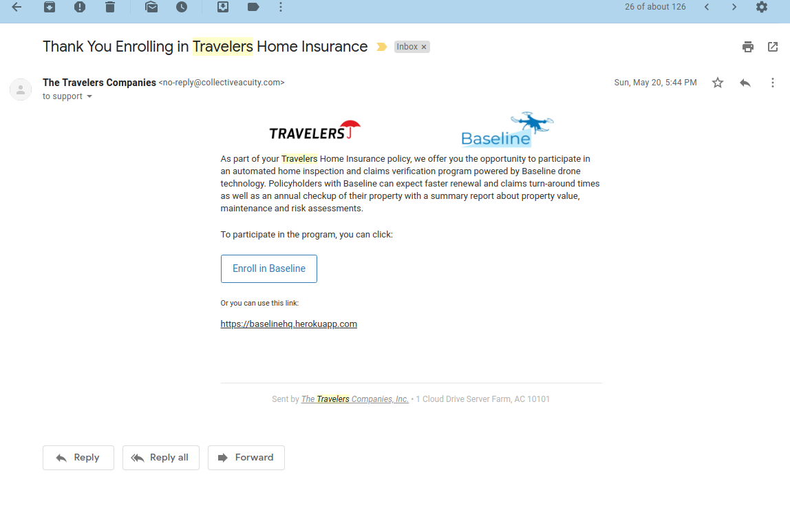
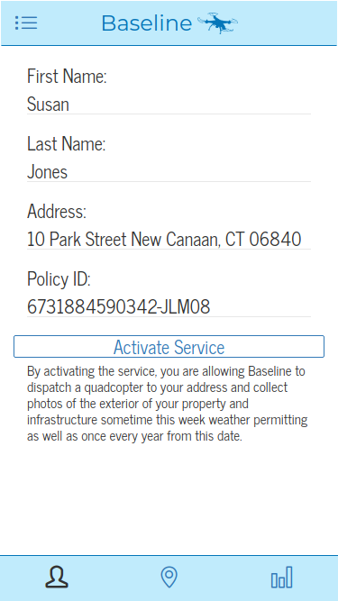
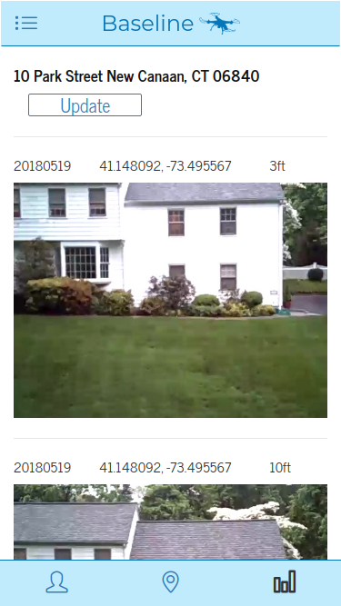

# Baseline
_Before & After Imagery for Insurance Claims Processing_   
**by Richard J & Dina Belyayeva**

## Introduction
Baseline is a drone-based platform made for Travelers Group and the [Hartford InsurTech Hub Hackathon](https://www.eventbrite.com/e/hartford-insurtech-hub-hackathon-customer-driven-claims-processing-using-ai-and-robotics-tickets-44926425147) which takes imagery both before & after a property damage claim. When a new policyholder signs up, Baseline dispatches a drone to inspect their property and collect a comprehensive set of images of the exterior of the property from a series of designated waypoints. These images form a baseline for the condition of the house which machine learning algorithms compare with images taken from the exact same waypoints after a claim is made to assess the extent of involvement required by a claims adjuster. A new set of imagery taken upon policy renewals also allow homeowners to receive annual updates on the condition of their property and advice on how to reduce potential threats. 

## Benefit
Baseline will streamline claims and improve underwriting through advanced remote sensing and machine learning. 

## Project Materials
[Slide Deck](https://docs.google.com/presentation/d/1Qdd8CGe7G5S-9OpA7RUKxXDXJ9A1_5KWQNy5NT6sb_c)

[Live Site](https://baselinehq.herokuapp.com?address=10%20Park%20Street%20New%20Canaan%2C%20CT%2006840)  

[GitHub Repo](https://github.com/rj919/baseline)  

## Components
- Python 3.6 (Language)
- Flask (Framework)
- Random Forest (Modeling Technique)
- Mailgun (Email Provider)  
- Cheerwing Syma X5SW-V3 (Demo Drone)

## Screenshots
__Email:__  

__Profile:__  
  

__Report:__  

